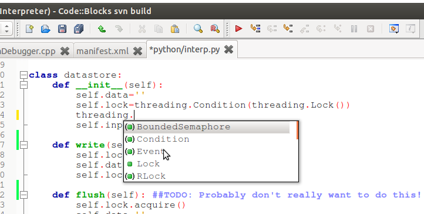
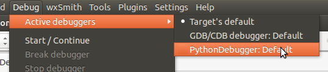
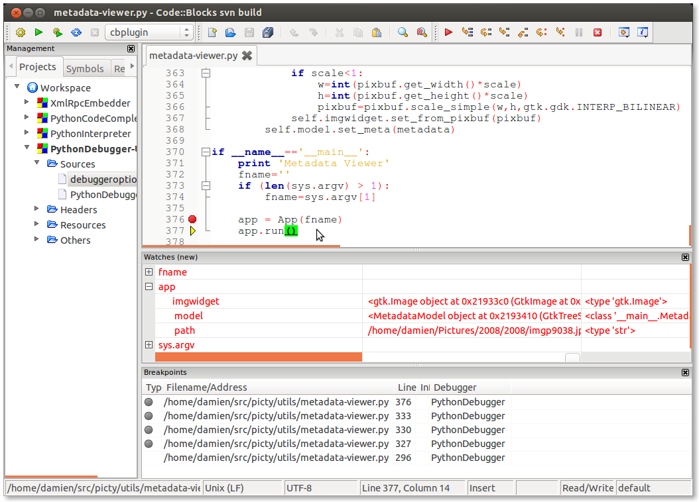
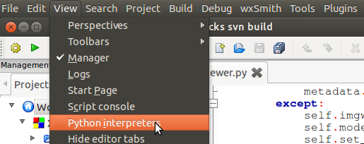
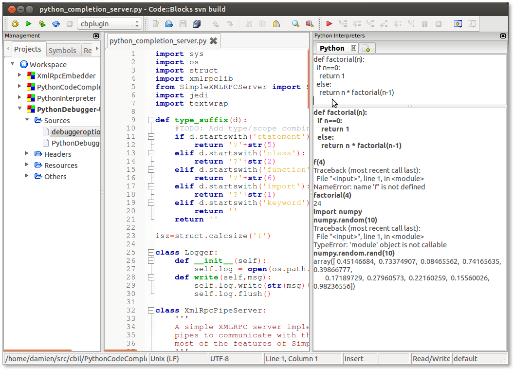

Codeblocks-Python
=================

A variety of plugins for the Code::Blocks IDE that will be useful for python programmers. Plugins include:

* Code completion
* Visual debugger
* Python interpreter console

All plugins assume that python is installed and in the system path.

Code Completion
---------------

* Uses the jedi completion lib (must be installed)
* Provides completion tips for any open python source file
* TODO: Symbol browser pane, showing docstrings alongside completion hints,

Visual Debugger
---------------

* Uses pdb (installed by default in any python)
* TODO: add support for rpdb2

To use it, make the python debugger the active debugger from the debugger menu

Then open a source file and press Debug/Continue (from the Debugger toolbar or the Debugger menu).

Python Interpreter Console
--------------------------

* Run multiple python interpreters sessions inside a dockable pane in Code::Blocks
* Features syntax highlighting and automatic indentation in the code input control
* TODO: Handling stdin (e.g. raw_input), code completion hints, syntax error hints,
  extracting code/output from the I/O control, numbering instructions and output(?)

**Usage**

Show the interpreters panel using the View menu:

Each interpreter has 2 panes, one for editing and submitting blocks of code, the other
for displaying the history of submitted statements and any output

When the code control has the keyboard focus, press

* 'Enter' with the keyboard positioned at the end of your block of code to submit it to the interpreter
* 'Ctrl-Up' and 'Ctrl-Down' to browse through the history of previously submitted statements.

Ready Built Binaries
--------------------

Coming soon ...

Building from Source
--------------------

There are two Code::Blocks projects for each of the plugins (one for Windows and one for Linux) and the
XmlRpcEmbedder library that is used to control remote python processes from Code::Blocks. There
is also a workspace file for Windows and Linux containing all of the projects.

Use the "All" target to compile against Code::Blocks that you have built yourself. Read more about
building Code::Blocks at the Code::Blocks `Wiki <http://wiki.codeblocks.org/index.php?title=Category:Installing_Code::Blocks_from_source>`_

Use the "cbplugin" target to be able to install into a pre-built Code::Blocks (you must compile against
the headers that were used to create that version of Code::Blocks and link against the pre-built Code::Blocks
library files)

For the cbplugin targets, the plugins that use it should be statically linked against the XmlRpcEmbedder
lib if you want to be able to install the  plugins as cbplugin packages.

Get Help
--------

Use the issues to report problems or get support at the `Code::Blocks Forums <http://forums.codeblocks.org>`_
